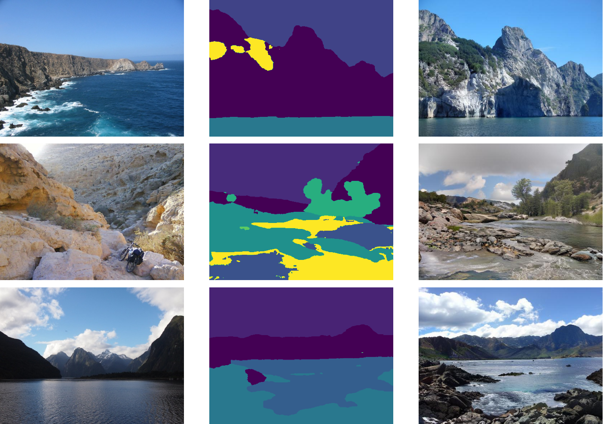
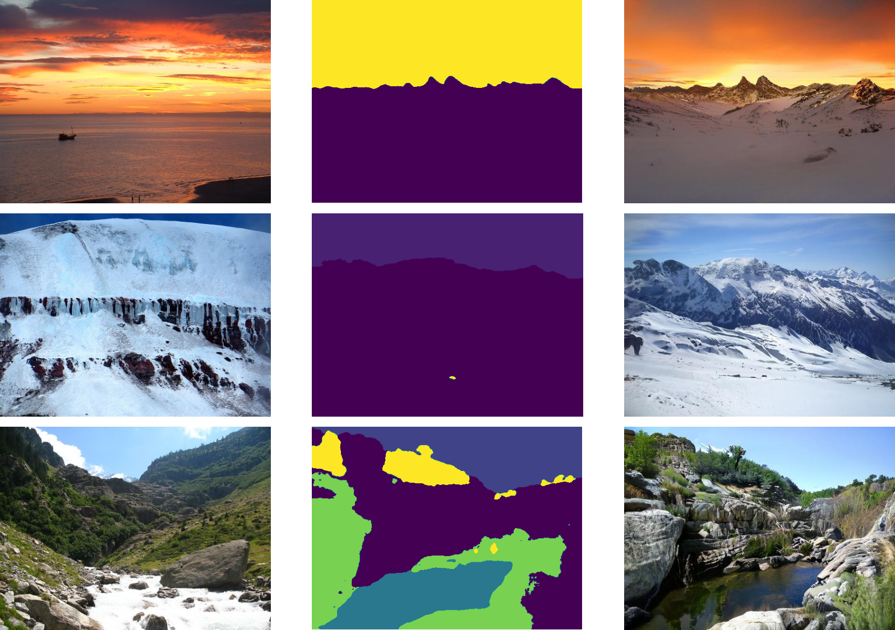

# Jittor 草图生成风景比赛 Latent-Semantic-Diffusion

## 简介

本项目包含了第三届计图挑战赛计图 - 草图生成风景比赛的代码实现。


## 安装

由于在Jittor上Gradient-checkpoint机制难以实现，本项目需要在6张3090上训练，训练时间为8天左右。我们后期会继续尝试实现，该机制可显著降低显存使用。

### 运行环境

- ubuntu 22.04 LTS
- python 3.8.5
- `sudo apt install libomp-dev`

- 安装mpi `sudo apt install mpich`

- 安装python库： `pip install -r requirements.txt`

- 根据cuda版本安装cupy：

  v11.1 (x86_64)  `pip install cupy-cuda111`

  v11.2 ~ 11.8 (x86_64 / aarch64) `pip install cupy-cuda11x`

  v12.x (x86_64 / aarch64) `pip install cupy-cuda12x`

## 数据集下载

清华大学计算机系图形学实验室从Flickr官网收集了12000张高清（宽512、高384）的风景图片，并制作了它们的语义分割图。其中，10000对图片被用来训练。**其中 label 是值在 0~28 的灰度图**

签包括29类物体，分别是

```
"mountain", "sky", "water", "sea", "rock", "tree", "earth", "hill", "river", "sand", "land", "building", "grass", "plant", "person", "boat", "waterfall", "wall", "pier", "path", "lake", "bridge", "field", "road", "railing", "fence", "ship", "house", "other" 
```

- 训练数据集可以从[这里](https://cloud.tsinghua.edu.cn/f/063e7fcfe6a04184904d/?dl=1)下载。

- A榜测试数据集可以从[这里](https://cloud.tsinghua.edu.cn/d/cb748039138145f2b971/)下载。

- B榜测试数据集可以从[这里](https://cloud.tsinghua.edu.cn/d/9dd48340bbde4d9b9ffa/)下载。

## 预训练模型

使用在ImageNet上训练的VQ-GAN作为AutoEncoder。

[下载checkpoint](https://drive.google.com/file/d/1nNpUzZSbYA5yWsNdzLeKNvHWwHcaJAPV/view?usp=sharing)

使用比赛数据集训练的AutoEncoder效果可能会更佳。

[如何预训练AutoEncoder?](https://github.com/CompVis/taming-transformers/tree/master#training-on-custom-data)

## 数据预处理

在训练开始时会自动对数据进行预处理。

## 推理

```
python test.py --input_path 测试数据路径 --img_path 参考图像路径 --output_path ./results
```

## 训练

```
python train.py --input_path 训练集路径
```

数据路径目录结构如下：

```
--input_path
	- val_B_labels_resized
	- label_to_img.json

--img_path
	- imgs
	- labels
```

训练结束之后，可以使用`merge-model.py`进行模型集成。

```
python merge_model --model_1 ./ckpts/model.pkl --weight_1 0.5 --model_2 ./ckpts/model2.pkl --weight_2 0.5
```

 [下载我们训练好的checkpoint](https://drive.google.com/file/d/12rqVXy7AJNM10oGtJkC76JbDhJplsR_C/view?usp=sharing)

## 生成图片样例

从左到右分别为  **参考图片**、**语义分割图片**、**生成图片**





## 致谢

此项目基于论文[Semantic Image Synthesis via Diffusion Models (SDM)](https://arxiv.org/abs/2207.00050)实现，部分代码参考了[Taming Transformers for High-Resolution Image Synthesis](https://github.com/CompVis/taming-transformers/tree/master)。